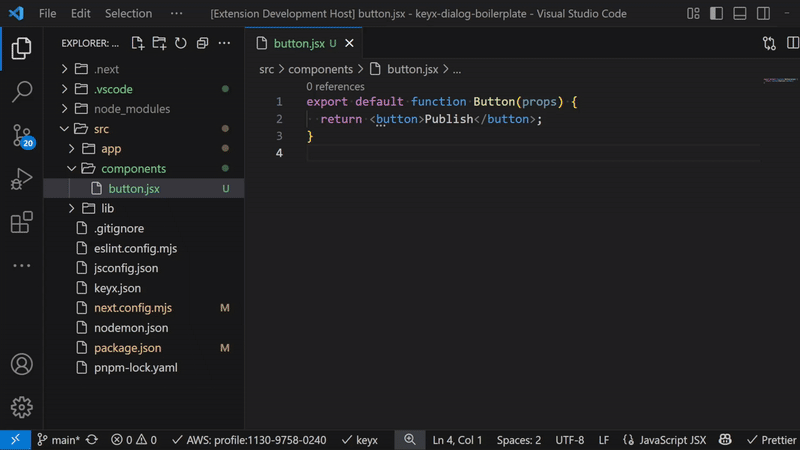

# Fast CSS Edit - VSCode Extension

Fast CSS Edit is a Visual Studio Code extension designed to streamline and simplify the process of editing CSS class definitions directly from React component files. It enables developers to quickly navigate and modify CSS styles associated with class names in JSX or TSX files without switching between multiple files.


Inspired by the popularity of Tailwind CSS, which is loved for its practicality and the ability to quickly edit styles without switching between CSS files, this extension aims to fill a similar gap by providing fast and easy CSS editing directly within React components.

[Get the extension on the Visual Studio Marketplace](https://marketplace.visualstudio.com/items?itemName=keyx.fast-css-edit)



## Features

- **Direct CSS Editing from React Components**  
  Hover over a CSS class name in a React component's `className` attribute to view its CSS definition in a popup.  
  Edit the CSS rule directly within the popup for quick adjustments.

- **Seamless Style File Detection**  
  Automatically detects the relevant CSS or CSS module file based on import statements or naming conventions:

  1. If a CSS file is imported, it uses the last imported CSS file as the style source.
  2. If multiple CSS files are imported, the last imported file is used.
  3. If no CSS file is imported, it falls back to a style file named after the component (configurable).
  4. Supports mixed usage of CSS and CSS modules, correctly resolving class names.

- **Code Lens for Quick Navigation and Editing**  
  Use Ctrl+Click on a CSS class name to jump directly to its definition in the style file.  
  If the class does not exist, it will be created at the end of the style file and the editor will scroll to it.

- **CSS Class Deletion Shortcut**  
  Press Ctrl+Shift+D to delete a CSS class from the component's `className` attribute and remove its definition from the style file, ensuring clean and maintainable styles.

- **Configurable Class Name Detection**  
  Supports different class name patterns for CSS, Sass, SCSS, and CSS modules.  
  Users can configure regex or other patterns to match their preferred coding style.

## Usage

1. Open a React component file (`.jsx` or `.tsx`) with CSS classes in the `className` attribute.
2. Hover over a class name to see its CSS rule in a popup with an option to delete the class.
3. Use Ctrl+Click on a class name to jump to or create its CSS definition in the style file.
4. Use Ctrl+Shift+D to delete a class from both the component and the style file.

## Configuration

- **Style File Naming Convention**  
  Configure the default style file name pattern used when no CSS import is found.
- **CSS Module Identifier**  
  Configure the identifier used for CSS modules (e.g., `styles`).

## Example

```jsx
// src/components/button/index.jsx
import styles from "./index.module.css";

export default function Button(props) {
  return <button className={`base-button ${styles.btn}`} {...props} />;
}
```

```css
/* src/components/button/index.module.css */
.btn {
  appearance: none;
  border: 1px solid;
}
```

## Installation

Install the Fast CSS Edit extension from the Visual Studio Code Marketplace.

## License

MIT License
